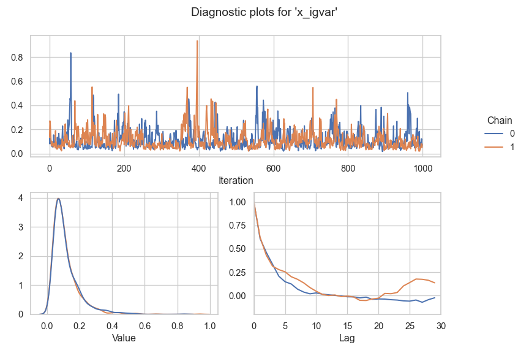

# Bayesian Conditional Transformation Models in Liesel

[](https://github.com/liesel-devs/liesel-bctm/actions/workflows/pre-commit.yml)
[](https://github.com/liesel-devs/liesel-bctm/actions/workflows/pytest.yml)
[](https://github.com/liesel-devs/liesel-bctm/actions/workflows/pytest.yml)

`bctm` is a Python library for building Bayesian Conditional
Transformation Models and sampling from their parameter’s posterior
distribution via MCMC. It is built on top of the probabilistic
programming framework Liesel.

For more on Liesel, see

- [The Liesel documentation](https://docs.liesel-project.org/en/latest/)
- [The Liesel GitHub repository](https://github.com/liesel-devs/liesel)

For more on Bayesian Conditional Transformation Models, see

- [Carlan, Kneib & Klein (2022). Bayesian Conditional Transformation
  Models](https://arxiv.org/abs/2012.11016)
- [Carlan & Kneib (2022). Bayesian discrete conditional transformation
  models](https://journals.sagepub.com/doi/10.1177/1471082X221114177)

## Example usage

For a start, we import the relevant packages.

``` python
import numpy as np
import liesel.model as lsl
import liesel.goose as gs
import liesel_bctm as bctm
```

### Data generation

Next, we generate some data. We do that by defining a data-generating
function - this function will become useful for comparing our model
performance to the actual distribution later.

``` python
rng = np.random.default_rng(seed=3)

def dgf(x, n):
    """Data-generating function."""
    return rng.normal(loc=1. + 5*np.cos(x), scale=2., size=n)

n = 300
x = np.sort(rng.uniform(-2, 2, size=n))

y = dgf(x, n)
data = dict(y=y, x=x)
```

Let’s have a look at a scatter plot for these data. The solid blue line
shows the expected value.

    Warning: Using `size` aesthetic for lines was deprecated in ggplot2 3.4.0.
    ℹ Please use `linewidth` instead.


### Model building

Now, we can build a model:

``` python
# | label: Build model
ctmb = (
    bctm.CTMBuilder(data)
    .add_intercept()
    .add_trafo("y", nparam=15, a=1.0, b=0.001, name="y")
    .add_pspline("x", nparam=15, a=1.0, b=0.001, name="x")
    .add_response("y")
)

model = ctmb.build_model()
```

Let’s have a look at the model graph:

``` python
lsl.plot_vars(model)
```


### MCMC sampling

With `bctm.ctm_mcmc`, it’s easy to set up an
[EngineBuilder](https://docs.liesel-project.org/en/latest/generated/liesel.goose.builder.EngineBuilder.html)
with predefined MCMC kernels for our model parameters. We just need to
define the warmup duration and the number of desired posterior samples,
then we are good to go.

``` python
nchains = 2
nsamples = 1000
eb = bctm.ctm_mcmc(model, seed=1, num_chains=nchains)
eb.positions_included += ["z"]
eb.set_duration(warmup_duration=500, posterior_duration=nsamples)

engine = eb.build()
engine.sample_all_epochs()
```


      0%|                                                  | 0/3 [00:00<?, ?chunk/s]
     33%|##############                            | 1/3 [00:04<00:09,  4.60s/chunk]
    100%|##########################################| 3/3 [00:04<00:00,  1.53s/chunk]

      0%|                                                  | 0/1 [00:00<?, ?chunk/s]
    100%|########################################| 1/1 [00:00<00:00, 2091.92chunk/s]

      0%|                                                  | 0/2 [00:00<?, ?chunk/s]
    100%|########################################| 2/2 [00:00<00:00, 2460.72chunk/s]

      0%|                                                  | 0/4 [00:00<?, ?chunk/s]
    100%|########################################| 4/4 [00:00<00:00, 2775.85chunk/s]

      0%|                                                  | 0/8 [00:00<?, ?chunk/s]
    100%|#########################################| 8/8 [00:00<00:00, 314.62chunk/s]

      0%|                                                  | 0/2 [00:00<?, ?chunk/s]
    100%|########################################| 2/2 [00:00<00:00, 2450.66chunk/s]

      0%|                                                 | 0/40 [00:00<?, ?chunk/s]
     38%|##############6                        | 15/40 [00:00<00:00, 135.43chunk/s]
     72%|#############################           | 29/40 [00:00<00:00, 91.36chunk/s]
     98%|####################################### | 39/40 [00:00<00:00, 77.46chunk/s]
    100%|########################################| 40/40 [00:00<00:00, 84.11chunk/s]

``` python

results = engine.get_results()
samples = results.get_posterior_samples()
```

### Posterior predictive conditional distribution

To interpret our model, we now define some fixed covariate values for
which we are going to evaluate the conditional distribution. We also
define an even grid of response values to use in the evaluations. The
function `bctm.grid` helps us to create arrays of fitting length.

``` python
yvals = np.linspace(np.min(y), np.max(y), 100)
xvals = np.linspace(np.min(x), np.max(x), 6).round(2)[1:-1]
ygrid, xgrid = bctm.grid(yvals, xvals)
```

To get a sense of how well our model captures the true distribution of
the response even for complex data-generating mechanism, `bctm` offers
the helper function `bctm.samle_dgf`. This function gives us a
data-frame with our desired number of samples, each for a grid of
covariate values. We just need to enter the data-generating function
that we defined above.

``` python
dgf_samples = bctm.sample_dgf(dgf, 5000, x=xvals)
dgf_samples
```

           index    x         y
    0          0 -1.2  4.344596
    1          1 -1.2  4.224118
    2          2 -1.2  4.365094
    3          3 -1.2  4.452642
    4          4 -1.2  0.833007
    ...      ...  ...       ...
    19995   4995  1.2  3.966420
    19996   4996  1.2  2.106471
    19997   4997  1.2  3.516566
    19998   4998  1.2 -0.466490
    19999   4999  1.2  0.156236

    [20000 rows x 3 columns]

#### Uncertainty visualization via quantiles

Next, we evaluate the transformation density for our fixed covariate
values. The function `bctm.dist_df` does that for us. It evaluates the
transformation density for each individual MCMC sample and returns a
summary data-frame that contains the mean and some quantiles of our
choice (default: 0.1, 0.5, 0.9).

``` python
dist_df = bctm.cdist_quantiles(samples, ctmb, y=ygrid, x=xgrid)
dist_df
```

           id summary   x0         y0       pdf       cdf   log_prob
    0       0    mean -1.2  -5.504508  0.000077  0.000045 -10.008450
    1       1    mean -1.2  -5.341085  0.000102  0.000059  -9.688223
    2       2    mean -1.2  -5.177663  0.000134  0.000078  -9.374289
    3       3    mean -1.2  -5.014240  0.000175  0.000103  -9.066619
    4       4    mean -1.2  -4.850818  0.000229  0.000136  -8.765223
    ...   ...     ...  ...        ...       ...       ...        ...
    1595  395    q0.9  1.2  10.020624  0.000670  0.999957  -7.308916
    1596  396    q0.9  1.2  10.184047  0.000505  0.999971  -7.590997
    1597  397    q0.9  1.2  10.347469  0.000379  0.999980  -7.877084
    1598  398    q0.9  1.2  10.510891  0.000285  0.999987  -8.161404
    1599  399    q0.9  1.2  10.674314  0.000213  0.999992  -8.453438

    [1600 rows x 7 columns]

Now it is time to plot the estimated distribution. For this part, I like
to switch to R, because `ggplot2` is just amazing. I load `reticulate`
here, too, because that lets us access Python objects from within R.

``` r
library(reticulate)
library(tidyverse)
```

    ── Attaching core tidyverse packages ──────────────────────── tidyverse 2.0.0 ──
    ✔ dplyr     1.1.4     ✔ readr     2.1.5
    ✔ forcats   1.0.0     ✔ stringr   1.5.1
    ✔ lubridate 1.9.4     ✔ tibble    3.3.0
    ✔ purrr     1.0.4     ✔ tidyr     1.3.1
    ── Conflicts ────────────────────────────────────────── tidyverse_conflicts() ──
    ✖ dplyr::filter() masks stats::filter()
    ✖ dplyr::lag()    masks stats::lag()
    ℹ Use the conflicted package (<http://conflicted.r-lib.org/>) to force all conflicts to become errors

For easy handling during plotting, I transform the data to wide format.

``` r
dist_df <- py$dist_df

dist_df_wide <- dist_df |>
    pivot_wider(
        names_from = "summary",
        values_from = c("pdf", "cdf", "log_prob")
    ) |>
        rename(y = y0, x = x0)
```

Next, it is time for our plot:

``` r
dist_df_wide |>
    ggplot() +
    geom_ribbon(aes(x=y, ymin=`pdf_q0.1`, ymax=`pdf_q0.9`),
                fill = "#56B4E9",
                alpha = 0.5) +
    geom_density(data = py$dgf_samples,
                 aes(y),
                 linetype = "dotted",
                 adjust=2) +
    geom_line(aes(y, `pdf_q0.5`)) +
    facet_wrap(~x, labeller = label_both) +
    labs(
        x = "Response",
        y = "Density",
        title = "Posterior estimates of the response distribution",
        subtitle = "Shaded area shows 0.1 - 0.9 quantiles.\n
        Dotted line is KDE of samples from the data-generating function."
    )
```


#### Uncertainty visualization via random samples

``` python
rdist_df = bctm.cdist_rsample(samples, ctmb, size=100, y=ygrid, x=xgrid)
rdist_df
```

                pdf       cdf   log_prob          y    x  id
    0      0.000038  0.000017 -10.189403  -5.504508 -1.2   0
    1      0.000053  0.000024  -9.854477  -5.341085 -1.2   0
    2      0.000073  0.000035  -9.526793  -5.177663 -1.2   0
    3      0.000100  0.000049  -9.206268  -5.014240 -1.2   0
    4      0.000137  0.000068  -8.892830  -4.850818 -1.2   0
    ...         ...       ...        ...        ...  ...  ..
    39995  0.000126  0.999943  -8.979519  10.020624  1.2  99
    39996  0.000090  0.999960  -9.320920  10.184047  1.2  99
    39997  0.000063  0.999973  -9.670265  10.347469  1.2  99
    39998  0.000044  0.999981 -10.027784  10.510891  1.2  99
    39999  0.000031  0.999987 -10.393733  10.674314  1.2  99

    [40000 rows x 6 columns]

``` r
py$rdist_df |>
    ggplot() +
    geom_line(aes(y, pdf, group = id), alpha = 0.15, color = "#56B4E9") +
    geom_line(data = dist_df_wide, aes(y, `pdf_q0.5`)) +
    geom_density(data = py$dgf_samples, aes(y), linetype = "dotted", adjust=2) +
    facet_wrap(~x, labeller = label_both) +
        labs(
        x = "Response",
        y = "Density",
        title = "Posterior estimates of the response distribution",
        subtitle = "Blue: 100 samples from the posterior predictions. Solid: Median.\n
        Dotted line is KDE of samples from the data-generating function."
    )
```


### Plot the transformation function

#### Transformation part

``` python
tf_quantiles = bctm.partial_ctrans_quantiles(samples, ctmb, y=yvals)
tf_samples = bctm.partial_ctrans_rsample(samples, ctmb, y=yvals, size=50)
```

``` r
tf_wide <- py$tf_quantiles |> pivot_wider(
    names_from = "summary", values_from = c("value", "value_d")
)

tf_wide |>
    ggplot() +
    geom_line(
        data = py$tf_samples,
        aes(y, value, group = id),
        color = "#56B4E9",
        alpha = 0.2
    ) +
    geom_line(aes(y, `value_q0.5`)) +
    labs(
        x = "Response",
        y = expression(h[0](y)),
        title = "Conditional transformation function",
        subtitle = "Black: Median, Blue: 50 random samples from the posterior"
    )
```

-1.png)

#### Location shift part

``` python
xvals = np.linspace(np.min(x), np.max(x), 100)
tf_quantiles = bctm.partial_ctrans_quantiles(samples, ctmb, x=xvals)
tf_samples = bctm.partial_ctrans_rsample(samples, ctmb, x=xvals, size=50)
```

``` r
tf_wide <- py$tf_quantiles |>
    pivot_wider(names_from = "summary",
                values_from = c("value"),
                names_prefix="value_")

tf_wide |>
    ggplot() +
    geom_line(
        data = py$tf_samples,
        aes(x, value, group = id),
        color = "#56B4E9",
        alpha = 0.2
    ) +
    geom_line(aes(x, `value_q0.5`)) +
    labs(
        x = "Response",
        y = expression(h[1](x)),
        title = "Conditional transformation function",
        subtitle = "Black: Median, Blue: 50 random samples from the posterior"
    )
```

-1.png)

### Diagnostics

#### Distribution of the latent variable

``` python
z = bctm.ConditionalPredictions(samples, ctmb).ctrans().mean(axis=(0,1))
```

``` r
kde_plot <- ggplot() +
    stat_function(fun = dnorm, linetype = "dotted") +
    geom_density(aes(py$z), adjust = 1) +
    labs(x = "h(y|x)", title = "Kernel density estimator for h(y|x)",
         subtitle = "Dotted line: True Standard Normal distribution") +
    NULL

qq_plot <- ggplot() +
    aes(sample = py$z, color="h(y|x)") +
    stat_qq() +
    stat_qq(aes(sample = py$y, color="y"), alpha=0.6) +
    stat_qq_line(color="black") +
    labs(x = "Theoretical quantile", y="Empirical quantile",
         title = "QQ-plot for latent variable h(y|x) and y")

ggpubr::ggarrange(qq_plot, kde_plot, ncol = 2, common.legend = TRUE, legend = "top")
```


#### rhat

``` python
summary = gs.Summary(results)
summary_df = summary._param_df().reset_index()
error_df = summary._error_df().reset_index()
error_df = error_df.astype({"count": "int32", "relative": "float32"})
```

``` r
py$summary_df |>
    filter(parameter != "z") |>
    group_by(parameter) |>
    mutate(index = seq(0, n()-1)) |>
    mutate(parameter_i = paste0(parameter, "[", sprintf("%02d", index), "]")) |>
    relocate(parameter_i) |>
    ggplot() +
    geom_point(aes(parameter_i, rhat)) +
    geom_line(aes(parameter_i, rhat, group=1), alpha = 0.5) +
    geom_hline(yintercept = 1.01, linetype = "dotted") +
    coord_flip() +
    NULL
```


#### Effective sample size

``` r
py$summary_df |>
    filter(parameter != "z") |>
    group_by(parameter) |>
    mutate(index = seq(0, n()-1)) |>
    mutate(parameter_i = paste0(parameter, "[", sprintf("%02d", index), "]")) |>
    relocate(parameter_i) |>
    ggplot() +
    aes(parameter_i, ess_bulk) +
    # aes(parameter_i, ess_bulk, color=dgf) +
    geom_point() +
    geom_line(aes(group = 1), alpha = 0.5) +
    geom_hline(yintercept = py$nchains*py$nsamples, linetype = "dotted") +
    coord_flip() +
    # facet_wrap(~dgf, nrow = 4) +
    labs(title = "Effective sample sizes (ESS Bulk)",
         subtitle = "Dotted line: Actual number of MCMC draws.") +
    NULL
```


``` r
py$summary_df |>
    filter(parameter != "z") |>
    group_by(parameter) |>
    mutate(index = seq(0, n()-1)) |>
    mutate(parameter_i = paste0(parameter, "[", sprintf("%02d", index), "]")) |>
    relocate(parameter_i) |>
    ggplot() +
    aes(parameter_i, ess_tail) +
    geom_point() +
    geom_line(aes(group = 1), alpha = 0.5) +
    geom_hline(yintercept = py$nchains*py$nsamples, linetype = "dotted") +
    coord_flip() +
    # facet_wrap(~dgf, nrow = 4) +
    labs(title = "Effective sample sizes (ESS Tail)",
         subtitle = "Dotted line: Actual number of MCMC draws.") +
    NULL
```


#### Transition errors

``` r
py$error_df |>
    ggplot() +
    aes(error_msg, relative) +
    geom_bar(aes(fill = error_msg), stat = "identity",
             position = position_dodge2(preserve = "single")) +
    facet_wrap(~phase) +
    theme(legend.position = "top") +
    labs(title = "Error Summary") +
    NULL
```


#### Variance parameter plots

``` python
gs.plot_param(results, "y_igvar")
```


``` python
# | label: Diagnostic plots for variance of pspline
gs.plot_param(results, "x_igvar")
```


